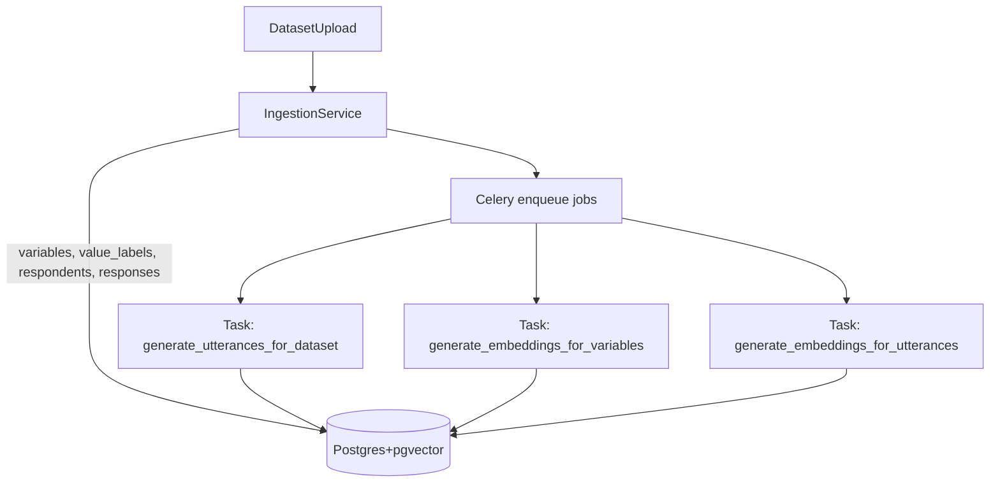

# Research Workflow Layer & Question Router Plan

## Genel Bakış

- **Amaç**: Mevcut SAV/Excel ingestion + smart filters + twin transformation katmanının üstüne, **Mode A (Structured / SQL)** ve **Mode B (RAG / utterances)** arasında akıllı yönlendirme yapan, kanıt+provenans zorunlu, guardrail’li bir araştırma workflow katmanı inşa etmek.
- **Temel ilkeler**: İstatistikler **her zaman SQL/aggregation** ile; LLM sadece **anlatı / özetleyici**; her cevapta **evidence_json + citations/provenance** zorunlu; uyuşmazlıkta **"Data mismatch—unable to generate safe narrative."** döndürmek.

## Mimari Genel Görünüm

```mermaid
flowchart TD
    userQuestion[UserQuestion] --> router[QuestionRouterService]
    router -->|mode=structured| structured[StructuredAggregationService]
    router -->|mode=rag| rag[RAGService]

    structured --> evidenceA[evidence_json_A]
    rag --> evidenceB[evidence_json_B]

    evidenceA --> narrationA[NarrationService (structured, number injection)]
    evidenceB --> narrationB[NarrationService (rag, themes)]

    narrationA --> threadResultA[ThreadResult]
    narrationB --> threadResultB[ThreadResult]
```





## 1. Veri Modeli ve Ingestion Doğrulama (Mode A Temeli)

- **Mevcut modeller** (`backend/models.py`) zaten gereksinimleri büyük ölçüde karşılıyor:
- **variables** → `Variable`
- **value_labels** → `ValueLabel`
- **respondents** → `Respondent`
- **responses** → `Response`
- **utterances** → `Utterance` (canonical `text_for_embedding` alanıyla birlikte)
- **embeddings** → `Embedding`
- **audiences/audience_members** → `Audience`, `AudienceMember`
- **threads, thread_questions, thread_results, cache_answers** → `Thread`, `ThreadQuestion`, `ThreadResult`, `CacheAnswer`.
- **Yapılacaklar**:
- **1.1** `IngestionService.populate_respondents_and_responses` içinde (`backend/services/ingestion_service.py`):
    - Değer kodu normalizasyonu ile `ValueLabel.value_code` ve `Response.value_code` eşleşmesini tekrar gözden geçir (şu an numeric için int cast yapılıyor; structured aggregation’ın kullandığı `Float` cast ile uyumu doğrula).
    - Gerekirse küçük bir yardımcı fonksiyon ekleyip **tek bir normalizasyon stratejisi** kullan (örn. "1" vs "1.0" problemi için ortak helper).
- **1.2** `Variable.stats_json` ve temel metriklerin (cardinality, response_count, response_rate) ingestion sonrası doldurulmasını veya güncellenmesini netleştir (gerekirse küçük ek update fonksiyonları ekleyerek; ileride cache/kalite raporları için kullanılacak).
- **1.3** Veritabanı tarafında pgvector eklentisi ve `embeddings.vector` kullanımının mevcut migrasyonlarla uyumlu olduğunu doğrula (gerekirse sadece dokümantasyonda belirt; kod zaten `CAST(e.vector AS vector)` kullanıyor).

## 2. Audience + AudienceMember Materialization

- **Mevcut durum**: `Audience` ve `AudienceMember` modelleri tanımlı, `StructuredAggregationService` audience join’lerini aktif sürüm (`active_membership_version`) üzerinden kullanıyor.
- **Yapılacaklar**:
- **2.1** `backend/services/audience_service.py` içinde (zaten var):
    - Audience create/update sırasında **filter_json → audience_members** materyalizasyon pipeline’ını tamamla/gözden geçir (örn. bir `rebuild_membership(dataset_id, audience_id)` fonksiyonu ile):
    - Filtre tanımına göre `Respondent` tablosunu tarayıp eşleşenleri `AudienceMember` olarak yaz.
    - Yeni bir `version` üret ve `Audience.active_membership_version`’ı atomik olarak güncelle (swap modeli zaten modelde var).
- **2.2** Bu materyalizasyonu tetikleyen uç noktaları `backend/routers/research.py` veya ilgili audience router’ında netleştir (create/update sonrası async job veya senkron küçük datasetler için inline).
- **2.3** `StructuredAggregationService.get_base_n` ve diğer aggregation fonksiyonlarının, `AudienceMember.version == Audience.active_membership_version` filtresiyle **tutarlı** olarak çalıştığını doğrula (şu an büyük oranda doğru; sadece yeni helper ile standardize edilebilir).

## 3. Question Router Geliştirmeleri (Mode Seçimi + Mapping)

- **Ana dosya**: `backend/services/question_router_service.py`.
- **3.1 Normalization**: **mevcut `normalize_question` fonksiyonu** zaten lowercase + punctuation temizliği yapıyor; bunu router çıktısında `normalized_question` alanı olarak hem `ThreadQuestion.normalized_question` hem de `CacheAnswer.normalized_question` için kullan.
- **3.2 Structured intent keyword listesi**:
- Router’a yeni bir `self.structured_keywords` alanı ekle, içeriği:
    - İngilizce: distribution, frequency, count, counts, %, percent, percentage, share, proportion, base n, valid n, response rate, average, mean, median, min, max, standard deviation, stats, top, bottom, compare, vs, difference, lift, higher, lower, gap, by, breakdown, split, segment, cohort, group, crosstab, "how many", "what share", "what percent" vs.
    - Türkçe: dağılım, frekans, adet, sayı, yüzde, oran, ortalama, medyan, istatistik, min, max, karşılaştır, kıyasla, fark, vs, kırılım, segment, "gruba göre", "X'e göre Y" benzeri pattern’ler.
- `route_question` içinde **Step 1** olarak:
    - `structured_intent = any(kw in normalized_question for kw in structured_keywords)` şeklinde bayrak üret.
    - Ayrıca regex ile **sayısal istek** pattern’lerini ("how many", "what percent", "kaç kişi", "yüzde kaç") tespit et.
- **3.3 Hard-map (var_code)**:
- Mevcut `_extract_var_codes_from_question` + DB kontrolü zaten var.
- İlave kural: Eğer var_code bulunduysa **mode’u doğrudan `structured`** seç ve `mapped_variables=[variable.id]` döndür (şu an yapıyor, sadece mapping_debug_json’a structured_intent ve keyword_match bilgilerini ekle).
- **3.4 Keyword → Mode forcing**:
- Akış:

    1. Structured intent keyword bulunursa `structured_intent=True`.
    2. Var_code hard-map bulunmazsa dahi, candidate mapping’in skor eşiğinin **az biraz altında** olsa bile, structured-intent varsa **Mode A lehine** “bias” uygula:

    - Örn. `if structured_intent and top_candidate.score >= threshold - 0.05: treat as structured`.

    1. Question hem **istatiksel** hem de **açıklayıcı** içeriyorsa (ör. "why" + "how many"), router output’una bir `mode_hint="hybrid"` veya `secondary_mode="rag"` ekle; ilk implementasyonda ise basit tutup **Mode A** + ileride `rag` ek açıklama için ayrı soru üret.

- **3.5 Candidate mapping & skor**:
- Mevcut `score_variable_match` fonksiyonu semantic + lexical + value_label_coverage + question_family + type_suitability skorlarını zaten topluyor.
- Yapılacak küçük eklemeler:
    - Structured intent varsa **type_suitability** ağırlığını biraz artır (ör. numeric/scale sorularında sayısal keyword’lere daha çok puan ver).
    - Demografik heuristic’i (age, gender vb.) için Türkçe kelimeleri genişlet (ör. "yaş grubu", "cinsiyet" vb. zaten var; gerekirse kısa eklemeler).
- **3.6 Breakdown / group_by detection**:
- `route_question` içine basit bir parser ekle:
    - "X by Y", "breakdown X by Y", "X'e göre Y" vb. pattern’ler için cümleyi iki kısma böl.
    - Her bir kısmı için `score_variable_match`/embedding pipeline’ını çalıştır ve en iyi iki değişkeni **primary** ve **group_by** olarak seç.
    - Router çıktısına `group_by_variable_id` alanını ekle.
    - İlk sürümde sadece **tek `group_by`** destekle.
- **3.7 Negation flags**:
- Mevcut `detect_negation` + `negation_ast` yapısı korunacak.
- Router output’una `negation_flags` olarak aynen geçir (şu an yapılıyor), fakat Thread tarafında da saklamak için `ThreadQuestion.negation_flags_json`’a yaz.
- **3.8 Output sözleşmesi** (router):
- Fonksiyon dönüşünü aşağıdaki forma stabilize et:
    ```python
                                {
                                  "mode": "structured" | "rag",
                                  "mapped_variables": [int],  # primary variable id list
                                  "group_by_variable_id": Optional[int],
                                  "negation_flags": {...},
                                  "mapping_debug_json": {
                                    "structured_intent": bool,
                                    "hard_mapped": bool,
                                    "candidates": [...],
                                    "chosen_variable_id": int | None,
                                    "group_by_variable_id": int | None,
                                    "reason": str,
                                    "threshold_used": float | str,
                                    "mode_selected": str,
                                    "normalized_question": str
                                  }
                                }
    ```


## 4. Structured Aggregation Service Geliştirmeleri

- **Ana dosya**: `backend/services/structured_aggregation_service.py`.
- **4.1 Tek değişken (distribution)**:
- `aggregate_single_choice` şu anda **base_n, answered_n, missing_n, response_rate, categories** hesaplıyor ve value label join’ini audience/no-audience durumunda farklı cast’lerle yapıyor.
- Yapılacaklar:
    - `ValueLabel` join koşulunu **tek bir helper fonksiyon** ile DRY hale getir (örn. numeric/string karışımını her iki dalda da aynı stratejiyle çözmek).
    - Label bulunamadığında kategori için `label = value_label or str(value_code)` ve evidence_json içine bir `warnings` alanı ekle: `"missing_label_codes": [..]`.
    - İleride RAG/narration için kullanmak üzere categories içine `"is_missing_label"` bilgisi gerekirse eklenebilir (ValueLabel’den okunarak).
- **4.2 Numeric aggregation**:
- `aggregate_numeric` min/max/mean + response rate’i hesaplıyor, median TODO.
- Şimdilik kullan-case’lerin çoğu distribution olduğundan median’ı TODO bırakmak kabul edilebilir; ancak evidence_json şemasını stabilize et:
    - `"stats": {"min": float, "max": float, "mean": float, "median": Optional[float]}`.
- **4.3 Breakdown (2D aggregation)**:
- `aggregate_with_breakdown` şu an placeholder.
- Planlanan minimum fonksiyonellik:
    - Audience/no-audience için Respondent + AudienceMember join’leriyle birlikte, `Response` tablosunu **iki değişken üzerinden** grupla:
    - primary: `variable_id == variable_id`
    - group_by: aynı respondent’in ilgili `group_by_variable_id` için `Response` kaydı.
    - Performans için iki yaklaşım:
    - Basit versiyon: Tek SQL’de self-join ile iki `Response` alias’ı (`r1`, `r2`) üzerinden group by (value_code1, value_code2).
    - İlk iterasyonda dataset boyutları sınırlı ise bu yeterli; daha sonra optimizasyon yapılabilir.
    - Evidence şeması örneği:
      ```json
                                                {
                                                  "question_text": "QV3_10 by AGE_GENDER_USA",
                                                  "primary_variable_code": "QV3_10",
                                                  "group_by_variable_code": "AGE_GENDER_USA",
                                                  "base_n": 1234,
                                                  "answered_n": 1200,
                                                  "response_rate": 0.973,
                                                  "missing_n": 34,
                                                  "cells": [
                                                    {
                                                      "row_value_code": "1",
                                                      "row_label": "Very satisfied",
                                                      "col_value_code": "F_65_74",
                                                      "col_label": "Female 65-74",
                                                      "count": 42,
                                                      "percent_of_row_valid": 23.5,
                                                      "percent_of_col_valid": 10.2
                                                    },
                                                    ...
                                                  ]
                                                }
      ```


    - Top 5 cell için (soru 3) structured answer servisi veya üst katmanda sort + slice yapacak.
- **4.4 Compare (audience vs total)**:
- Router seviyesinde "compare Baby Boomers vs total" gibi cümleler tespit edildiğinde:
    - Endpoint tarafında iki ayrı aggregation çağrısı yap:
    - **Segment (audience)**: mevcut audience_id.
    - **Total sample**: `audience_id=None` ile.
    - Sonuçları tek bir `evidence_json` içinde birleştir:
      ```json
                                                {
                                                  "comparison_type": "audience_vs_total",
                                                  "audience": { ...evidence_json_audience... },
                                                  "total": { ...evidence_json_total... }
                                                }
      ```


    - `StructuredAggregationService` içine bunu yapan küçük bir helper `compare_audience_vs_total` ekle (iki `aggregate_single_choice` çağrısı yapar).

## 5. RAG Service Geliştirme (Utterance + Citations)

- **Ana dosya**: `backend/services/rag_service.py` + `embedding_service.py` + `utterance_service.py`.
- **Mevcut durum**:
- `embedding_service` OpenAI embedding + pgvector sorgularını ve hem değişken hem utterance embedding üretimini hallediyor.
- `utterance_service` canonical formatta `text_for_embedding` ve hem responses hem de `TransformResult` tabanlı hibrit utterance üretimini sağlıyor.
- **5.1 retrieve_utterances**:
- Şu an `embedding_service.get_utterance_embeddings` kullanıyor; audience ve optional variable filtresi destekliyor.
- Burayı koru; sadece RAG modunda **primary variable mapping** varsa `variable_id` parametresini dolu geçir (örn. açıklayıcı open-text sorularında).
- **5.2 evidence_json + citations**:
- `build_evidence_json` fonksiyonunu, citations içine aşağıdaki alanları garanti edecek şekilde stabilize et:
    - `respondent_id`, `variable_id`, `var_code`, `snippet` (display_text), `question_text` (provenance’den), `score`.
- `evidence_json`:
    ```json
                                {
                                  "retrieved_count": 50,
                                  "citations": [...],
                                  "question_text": "What frustrations do respondents mention about energy providers?"
                                }
    ```


- **5.3 LLM synthesis (LLM-only-from-citations)**:
- `synthesize_with_llm` fonksiyonunu `openai_service` ile entegre et:
    - Prompt tasarımı: LLM’e **sadece citations listesi** ver, ve:
    - Yalnızca alıntılardan (snippet) tema üretmesini iste.
    - **Global yüzde/istatistik** üretmemesini, sadece "in the retrieved sample" formunda konuşmasını zorunlu kıl.
    - Her tema için en az 1–3 alıntı ID’sini (respondent_id + var_code) referans olarak dönmesini iste.
    - Çıktı formatı (modelden JSON beklenebilir, `openai_service` içindeki JSON Mode’dan faydalanarak):
      ```json
                                                {
                                                  "themes": [
                                                    {
                                                      "description": "High price sensitivity",
                                                      "support_count": 12,
                                                      "representative_quotes": [
                                                        {"text": "...", "respondent_id": 123, "var_code": "QV3_10"}
                                                      ]
                                                    }
                                                  ],
                                                  "caveats": ["Results are based on retrieved sample, not population percentages"],
                                                  "narrative": "In the retrieved sample, many respondents..."
                                                }
      ```


- RAG akışında bu çıktı, `NarrationService.generate_rag_narrative` için girdi olacak veya doğrudan narrative olarak kullanılacak (NarrationService bu durumda daha çok pass-through + ek caveat ekler).

## 6. Narration Service + Guardrails (Number Injection)

- **Ana dosya**: `backend/services/narration_service.py`.
- **6.1 Structured narrative’de sayı enjektesi**:
- `generate_structured_narrative` fonksiyonunu şu şekilde sadeleştir:
    - Tüm sayıları (`base_n`, `answered_n`, `response_rate`, category `percent` ve `count`) **önce Python’da string olarak üret**, sonra metni bu string’leri doğrudan kullanarak inşa et.
    - LLM’i kullanmak istersen:
    - `openai_service`’e şu tarz bir JSON prompt ver:
        ```json
                                                                {
                                                                  "question_text": "...",
                                                                  "evidence": { ...exact numbers as strings... },
                                                                  "allowed_numbers": ["100", "42", "23.5%", "95.8%"],
                                                                  "task": "Write 2-3 sentences using only the allowed_numbers; do not invent any new numbers."
                                                                }
        ```


    - LLM’den dönen metni **validation’dan geçir**; ancak sayılar zaten bizim sağladığımız listeyle sınırlı olduğu için mismatch ihtimali minimal.
    - İlk iterasyonda basit template (LLM’siz) tutmak da kabul edilebilir; plan, kodda LLM entegrasyonunu boundary’de bırakacak.
- **6.2 validate_numbers iyileştirme**:
- Mevcut fonksiyon zaten tolerance (±1.0) kullanıyor ve label kaynaklı sayılara karşı daha toleranslı.
- Plan:
    - `valid_numbers` listesine **bizim enjekte ettiğimiz string’lerin float karşılıklarını** da ekle.
    - Mismatch mesajlarını daha okunur hale getir (debug amaçlı).
- **6.3 validate_and_generate sözleşmesi**:
- `validate_and_generate` fonksiyonundan dönen yapıyı üst katmanlarda standart hale getir:
    ```json
                                {
                                  "narrative_text": "..." | "Data mismatch—unable to generate safe narrative.",
                                  "errors": [...],
                                  "is_valid": true/false,
                                  "narrative_output": { ...optional structured content... }
                                }
    ```


- Eğer `is_valid == False` ise, API katmanı **yine de `evidence_json` + chart_json**’u dönecek, ama narrative_text bu güvenli mesaj olacak.

## 7. Utterance + Embedding Pipeline’ının Otomasyonu (Celery)

- **Yeni/var olan dosyalar**: `backend/services/utterance_service.py`, `backend/services/embedding_service.py`, yeni bir `backend/celery_app.py` ve `backend/tasks/research_tasks.py`.
- **7.1 Celery app tanımı**:
- `backend/celery_app.py`:
    - Celery instance’ı (`celery_app`) tanımla, broker/result backend config’ini `config.settings` üzerinden al.
    - FastAPI `startup` event’i ile Redis/Rabbit ayarının dokümantasyonunu güncelle (deployment için README notu).
- **7.2 Background tasks**:
- `backend/tasks/research_tasks.py` içinde üç temel job tanımla:
    - `generate_utterances_for_dataset(dataset_id)` → `utterance_service.generate_utterances_for_dataset` çağırır.
    - `generate_embeddings_for_variables(dataset_id)` → `embedding_service.generate_embeddings_for_variables`.
    - `generate_embeddings_for_utterances(dataset_id)` → `embedding_service.generate_embeddings_for_utterances`.
- Her job:
    - İdempotent olacak şekilde tasarlanmalı; aynı dataset için tekrar çalışması duplicate üretmemeli (mevcut servisler zaten `existing` kontrolleri yapıyor).
- **7.3 Dataset upload entegrasyonu**:
- `backend/routers/research.py` veya dataset upload router’ında:
    - Ingestion tamamlandıktan sonra:
      ```python
                                                research_tasks.generate_utterances_for_dataset.delay(dataset_id)
                                                research_tasks.generate_embeddings_for_variables.delay(dataset_id)
                                                research_tasks.generate_embeddings_for_utterances.delay(dataset_id)
      ```


    - Bu sayede Mode A (structured) hemen çalışabilirken, Mode B (RAG) utterance+embedding hazır olduğunda devreye girer.

## 8. Thread & Answer Orkestrasyonu

- **İlgili modeller**: `Thread`, `ThreadQuestion`, `ThreadResult`, `CacheAnswer` (hepsi `backend/models.py`).
- **8.1 API flow (sade)**:
- Kullanıcı bir thread içinde soru sorduğunda (ör. `POST /threads/{thread_id}/questions`):
    - `ThreadQuestion` kaydı oluştur: `question_text`, `normalized_question`, `status="processing"`.
    - Router’ı çağır (`QuestionRouterService.route_question`), sonucunu `mode`, `mapped_variable_ids`, `negation_flags_json` alanlarına yaz.
    - Dataset’in `version` alanını oku; cache key’i oluştur:
    - `key = hash(dataset_id, dataset_version, audience_id, normalized_question, mode, mapped_variable_ids, group_by_variable_id)`.
    - `CacheAnswer` tablosunda bu key’i ara; varsa ilgili `ThreadResult`’a redirect et (**cache hit**).
    - Yoksa Celery’ye bir **answer job** sırala:
    - `run_thread_question_pipeline(thread_question_id)`.
- **8.2 Answer job pipeline** (`run_thread_question_pipeline` Celery task’i):
- Adımlar:

    1. DB’den `ThreadQuestion` ve ilişkili `Thread` + `Dataset` + `Audience`’ı çek.
    2. Router output’una bak (`mode`).
    3. **Mode A** ise:

    - `StructuredAggregationService` ile uygun aggregation’ı çağır (tek var / breakdown / compare).
    - `chart_json`’u `generate_chart_json` ile üret.
    - `NarrationService.validate_and_generate` ile structured narrative’i oluştur.

    1. **Mode B** ise:

    - `RAGService.retrieve_utterances` → `build_evidence_json`.
    - `RAGService.synthesize_with_llm` ile theme/narrative çıkar.
    - `NarrationService.validate_and_generate(mode="rag")` (burada sayısal guardrail çok hafif; esas guardrail, global yüzde kullanmama direktifinde).

    1. `ThreadResult` kaydını oluştur:

    - `dataset_version`, `evidence_json`, `chart_json`, `narrative_text`, `citations_json` (RAG için), `mapping_debug_json`, `model_info_json`.

    1. `CacheAnswer` kaydını oluştur.
    2. `ThreadQuestion.status="ready"` ve `Thread.status` güncellemeleri.

## 9. Router Keyword Forcing ve E2E Testler

- **Test dosyaları** (yeni):
- `backend/test_question_router_keywords.py`
- `backend/test_research_workflow_e2e.py`
- **9.1 Router keyword forcing testleri**:
- Örnek testler:
    - "Within Baby Boomers (60+), what is the distribution of QV3_10? Give counts and % valid." → `mode="structured"`, `mapped_variables` içinde `QV3_10` değişkeninin id’si, structured_intent=True.
    - "Compare Baby Boomers (60+) vs total sample for QV3_10. Return % valid by option." → `mode="structured"`, `group_by_variable_id=None` (compare audience vs total), `mapping_debug_json["reason"]` içinde compare kelimeleri.
    - "Why do Baby Boomers say they are not aware of the brand? Summarize themes with quotes." → `mode="rag"` (structured keyword yok, why/themes odaklı).
    - Eğer RAG-sim gibi bir soru içerisinde "what percent" geçiyorsa: router’ın **structured** seçtiğini doğrula.
- **9.2 E2E akış testleri** (mock DB ve/veya küçük fixture dataset ile):
- **Flow 1 (Structured)**:
    - Küçük bir dataset fixture’ı ile `IngestionService` → `generate_utterances_for_dataset` → `generate_embeddings_for_variables/utterances` çağırılmadan sadece Mode A route & aggregation’ın doğru çalıştığını test et.
    - Örnek soru: "What is the distribution of QV3_10?" → evidence_json’daki counts ve %’leri beklenen değerlerle karşılaştır.
- **Flow 2 (RAG)**:
    - Fixture utterances + embeddings oluşturarak (veya testte doğrudan DB’ye insert ederek) RAG pipeline’ını test et:
    - Router → `RAGService.retrieve_utterances` → `build_evidence_json` → `NarrationService.generate_rag_narrative`.
    - Narrative’ın global yüzde ifadeleri içermediğini ve citations listesiyle uyumlu olduğunu assert et.

## 10. "Data mismatch" Sorununun Çözümü

- Yukarıdaki adımlar kapsamında özellikle şunlar uygulanacak:
- Structured anlatıda **bütün sayılar `evidence_json`’dan string olarak enjekte edilecek**, LLM’in yeni sayı üretmesine izin verilmeyecek.
- `validate_numbers` toleranslı kalacak, fakat artık narrative içindeki tüm sayılar zaten `allowed_numbers` kümesinden geldiği için pratikte hata beklenmeyecek.
- Value label join’leri tek bir normalizasyon stratejisiyle tutarlı hale getirilecek; böylece evidence_json’daki label/kod kombinasyonları UI ve anlatı ile uyumlu kalacak.

## 11. Uygulama Sırası (Senin Belirttiğin Sıraya Hizalanmış)

1. **Mode A temeli**: Ingestion + `responses/respondents/value_labels` doğrulama ve küçük düzeltmeler.
2. **Audiences + audience_members** materyalizasyonunun sağlamlaştırılması.
3. **Question router** genişletmesi (structured intent keywords, var_code hard-map, breakdown tespiti) + structured aggregation endpoint entegrasyonu.
4. **Thread & cache persistence** pipeline’ının tamamlanması (question → router → Celery job → ThreadResult → CacheAnswer).
5. **Utterance generation** pipeline’ının (hem responses hem TransformResult hybrid) sağlamlaştırılması.
6. **Embeddings + RAG endpoint** (RAGService + embedding_service + LLM themes).
7. **Narration + guardrails** (number injection, validate_numbers iyileştirmesi, RAG quantifier politikası).
8. **Performans & UX**: caching, compare/breakdown optimizasyonları, ilgili frontend endpoint entegrasyonu.

## Önerilen Uygulama Todo’ları

- **setup-ingestion-baseline**: Ingestion sonrası `Variable`, `ValueLabel`, `Respondent`, `Response` bütünlüğünü ve value_code normalizasyonunu stabilize et.
- **audience-materialization**: Audience oluşturma/güncelleme için `AudienceMember` materyalizasyon pipeline’ını tamamla ve `get_base_n` ile uyumunu test et.